<div align="center"></div>

<br>

<div align="center">

[](https://github.com/amritkang165)&nbsp;
[](https://www.linkedin.com/in/amritkang28)&nbsp;
[](https://dev.to/amritkang165)&nbsp;
[](mailto:amritkang2805@icloud.com)

<br>

[](https://builder.aws.com/profile/jattkang)&nbsp;
[](https://github.com/amritkang165)

</div>

<br>

<div align="center"></div>

<br>

<div align="center">

*second-year CS at BITS Pilani. commits at 2am because that's when the ideas get loud.*
*full-stack · iOS · AI · too much coffee · in my building era.*

</div>

<br>

<div align="center"></div>

<br>

&nbsp;&nbsp;&nbsp;&nbsp;every day i pushed something, a flower grew here.
&nbsp;&nbsp;&nbsp;&nbsp;the bare soil is when i was sleeping. or shipping. probably both.

<br>

<div align="center">

</div>

<div align="center">
<sub><code>🌱</code> 1–2 &nbsp;·&nbsp; <code>🌷</code> 3–5 &nbsp;·&nbsp; <code>🌸</code> 6–9 &nbsp;·&nbsp; <code>🌺</code> 10+ commits &nbsp;·&nbsp; <code>·</code> touch grass day</sub>
</div>

<br>

<div align="center"></div>

<br>

&nbsp;&nbsp;&nbsp;&nbsp;**things i built** &nbsp;—

<br>

<details open>
<summary><kbd>&nbsp;🏙️ &nbsp;<b>MERAWARD</b>&nbsp;</kbd> &nbsp;<sup>civic tech · AWS · First Commit · Bharat Builds Tour 2026</sup></summary>

```
Delhi has 289 wards. most people don't know which one they're in.
MERAWARD fixes that — GPS ward lookup, voice/photo/text complaint
intake, AI-drafted bilingual letters, public neglect-index dashboard.

  ~2ms API response · sub-ms spatial lookups · 254 tests · 100 Lighthouse
  Bedrock decoupled behind SQS · serverless AWS stack via SAM IaC
  9 of 13 frontend commits are mine · ward pipeline · full UI
  team Sleepy Peeps · WeMakeDevs × AWS Builder Center

  Lambda · DynamoDB · S3 · SQS+DLQ · Bedrock · React 18 · MapLibre
```

&nbsp;&nbsp;&nbsp;&nbsp;→ [github.com/amritkang165/meraward](https://github.com/amritkang165/meraward)

</details>

---

<details open>
<summary><kbd>&nbsp;🧬 &nbsp;<b>ReGit</b>&nbsp;</kbd> &nbsp;<sup>Top 6 · Gradient Rush Hackathon · research VCS</sup></summary>

```
git diff on a PDF is a crime.

content-addressed commit DAG · semantic diff · 3-way prose merge
real-time CRDT collaborative editing (pycrdt ↔ yjs) with live presence
hybrid BM25 + vector retrieval · time-travel queries · delta-reindexing
fully offline single-process

  120 tests covering CRDT convergence and merge conflicts

  Python · FastAPI · React
```

&nbsp;&nbsp;&nbsp;&nbsp;→ [github.com/amritkang165/ReGit](https://github.com/amritkang165/ReGit)

</details>

---

<details open>
<summary><kbd>&nbsp;🍩 &nbsp;<b>Pocki</b>&nbsp;</kbd> &nbsp;<sup>native iOS · v1.2.0 · MIT · offline-first</sup></summary>

```
screenshot any UPI app. Pocki reads it.
works across GPay, PhonePe, Paytm, BHIM, Amazon Pay — no manual entry.
zero data leaves the phone. fully offline-first.
currently at v1.2.0, MIT-licensed, open source.

  Swift 6 · SwiftUI · SwiftData · Vision
```

&nbsp;&nbsp;&nbsp;&nbsp;→ [github.com/amritkang165/Pocki](https://github.com/amritkang165/Pocki)

</details>

---

<details open>
<summary><kbd>&nbsp;📅 &nbsp;<b>Placement Week Scheduler</b>&nbsp;</kbd> &nbsp;<sup>CP-SAT · 800 students · 35 companies</sup></summary>

```
scheduled 800 students across 35 companies and 20 rooms
1,123 shortlists · 99.5% interview coverage · zero clashes
90% room utilization

validity-based replanner re-solves only the affected slice per
disruption — touches 1.4% of appointments, produces a transparent diff.

  45 tests · Python · OR-Tools · FastAPI · React
```

&nbsp;&nbsp;&nbsp;&nbsp;→ [github.com/amritkang165/placement-week-scheduler](https://github.com/amritkang165/placement-week-scheduler)

</details>

---

<details open>
<summary><kbd>&nbsp;🤖 &nbsp;<b>exHacker</b>&nbsp;</kbd> &nbsp;<sup>7-agent pipeline · Hackarena</sup></summary>

```
challenge statement in. production-ready blueprint out. under 30s.

7-agent pipeline: challenge intel → research → competitor analysis
→ idea generation → solution architect → docs
turns a problem statement into a pitch-ready package.

  LangGraph · LangChain · FastAPI · Next.js · Docker
```

&nbsp;&nbsp;&nbsp;&nbsp;→ [github.com/amritkang165/exHacker](https://github.com/amritkang165/exHacker)

</details>

---

<details open>
<summary><kbd>&nbsp;🧠 &nbsp;<b>iffy.ai</b>&nbsp;</kbd> &nbsp;<sup>Top 7 of 350+ · ProdX @ NAVERA 26</sup></summary>

```
most "what if" tools give you an essay.
iffy gives you a typed consequence graph — every branch structured,
every outcome traceable, every hallucination caught by a
Zod validate-and-repair loop.

think before you believe.

  Groq · Zod · Next.js · PostgreSQL
```

&nbsp;&nbsp;&nbsp;&nbsp;→ [github.com/amritkang165/iffy-ai](https://github.com/amritkang165/iffy-ai)

</details>

---

<details>
<summary>&nbsp;&nbsp;<sup>🌿 &nbsp;more in the garden — click to expand</sup></summary>

<br>

<details>
<summary><kbd>&nbsp;👕 &nbsp;<b>WearWise</b>&nbsp;</kbd> &nbsp;<sup>AI wardrobe manager</sup></summary>

```
track what you own. stop wearing the same 3 things.
AI outfit recommendations. finally.

  Next.js · Prisma · PostgreSQL · Gemini
```
&nbsp;&nbsp;&nbsp;&nbsp;→ [github.com/amritkang165/wearwise](https://github.com/amritkang165/wearwise)
</details>

<details>
<summary><kbd>&nbsp;📱 &nbsp;<b>Gitty</b>&nbsp;</kbd> &nbsp;<sup>mobile GitHub client</sup></summary>

```
GitHub in your pocket. PRs at 2am in bed, comfortably.
search · trending · 8 dev tools · branch analysis

  React Native · TypeScript
```
&nbsp;&nbsp;&nbsp;&nbsp;→ [github.com/amritkang165/gitty](https://github.com/amritkang165/gitty)
</details>

<details>
<summary><kbd>&nbsp;🎨 &nbsp;<b>TintAudit</b>&nbsp;</kbd> &nbsp;<sup>Swift → WebAssembly</sup></summary>

```
WCAG contrast analyser in the browser.
built in Swift, compiled to WebAssembly via Tokamak. yes, really.

  Swift · WebAssembly · Tokamak
```
&nbsp;&nbsp;&nbsp;&nbsp;→ [github.com/amritkang165/TintAudit](https://github.com/amritkang165/TintAudit)
</details>

<details>
<summary><kbd>&nbsp;🔍 &nbsp;<b>LaunderLens</b>&nbsp;</kbd> &nbsp;<sup>RIFT Hackathon · fraud detection</sup></summary>

```
graph-based fraud detection engine.
detects circular fund routing and smurfing at 92% accuracy
on 1,000+ transactions.

  Node.js · Graph Algorithms
```
</details>

<details>
<summary><kbd>&nbsp;🎙️ &nbsp;<b>Oratio</b>&nbsp;</kbd> &nbsp;<sup>Replit Hackathon · AI debate</sup></summary>

```
voice-enabled AI debate platform.
real-time transcription · LCR-based judging system.

  WebSockets · LLM APIs
```
&nbsp;&nbsp;&nbsp;&nbsp;→ [github.com/amritkang165/Oratio](https://github.com/amritkang165/Oratio)
</details>

<details>
<summary><kbd>&nbsp;🐹 &nbsp;<b>Gotermi</b>&nbsp;</kbd> &nbsp;<sup>terminal pet</sup></summary>

```
a little creature that lives in your terminal
and reacts to your coding habits.

  Go · CLI
```
&nbsp;&nbsp;&nbsp;&nbsp;→ [github.com/amritkang165/Gotermi](https://github.com/amritkang165/Gotermi)
</details>

</details>

<br>

<div align="center"></div>

<br>

&nbsp;&nbsp;&nbsp;&nbsp;**track record** &nbsp;—

<br>

```
  🏆  Top team     First Commit · Bharat Builds Tour 2026    WeMakeDevs × AWS Builder Center
  🏆  Top 6        Gradient Rush Hackathon                   ReGit — research VCS
  🏆  Top 7/350+   ProdX @ NAVERA 26                         iffy.ai
  💼  SDE Intern   Grabware  (May–Jul 2026)                  15+ production sites, MERN migration
  🎓  BITS Pilani  B.E. Computer Science  ·  CGPA 9.27
  🌐  HackClub     Bengaluru Organizer                       Sunbeam — 40 cities globally
  🎤  Ignite Room  Events Lead                               venue · volunteers · speakers
```

<br>

<div align="center"></div>

<br>

&nbsp;&nbsp;&nbsp;&nbsp;**by the numbers** &nbsp;— *verified against the GitHub API, not a third-party stats widget*

<br>

```
  602   contributions this year
  539   commits pushed
   33   repositories · 29 actively touched
    4   pull requests merged
```

<br>

<div align="center"></div>

<br>

&nbsp;&nbsp;&nbsp;&nbsp;**right now —**

<br>

```
  ┌─ shipping ──────────────────────────────────────────────────────┐
  │  🚢  MERAWARD is live                                           │
  │  🪷  Pocki v2 · WearWise — both blooming                       │
  └─────────────────────────────────────────────────────────────────┘

  ┌─ learning ──────────────────────────────────────────────────────┐
  │  🍎  Apple-specific deep cuts                                   │
  │      SwiftUI · CoreData · StoreKit · WidgetKit · CoreML         │
  │                                                                 │
  │  📐  System Design                                              │
  │      clashing with DSA bare minimum daily. both bleeding.       │
  │                                                                 │
  │  🤖  LLM tooling layer                                          │
  │      agents · evals · structured outputs · tool use             │
  └─────────────────────────────────────────────────────────────────┘

  ┌─ reading ───────────────────────────────────────────────────────┐
  │  Designing Data-Intensive Applications                          │
  │  Apple Human Interface Guidelines  (yes, the whole thing)       │
  └─────────────────────────────────────────────────────────────────┘

  ☕  coffee  ▰▰▰▰▰▰▰▰▰▱  medically concerning
```

<br>

<div align="center">


<br>

<br>


</div>

<br>

<div align="center"></div>

<br>

<div align="center">


&nbsp;&nbsp;


</div>

<br>

<div align="center"></div>

<br>

*what's here is what i still stand behind.*

<br>

<div align="center"></div>
